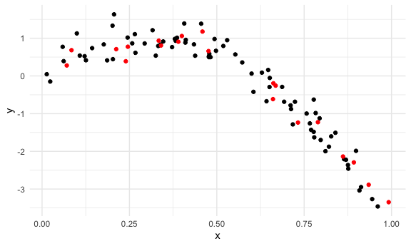
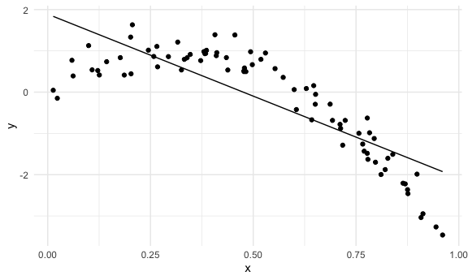
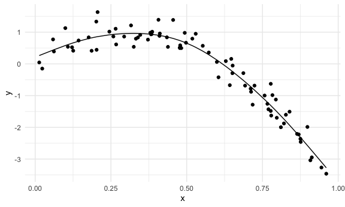
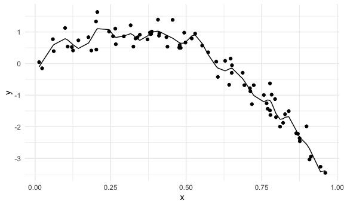

Cross Validation
================

Load libraries that you will need:

``` r
library(tidyverse)
```

    ## ── Attaching packages ─────────────────────────────────────── tidyverse 1.3.1 ──

    ## ✓ ggplot2 3.3.5     ✓ purrr   0.3.4
    ## ✓ tibble  3.1.3     ✓ dplyr   1.0.7
    ## ✓ tidyr   1.1.3     ✓ stringr 1.4.0
    ## ✓ readr   2.0.1     ✓ forcats 0.5.1

    ## ── Conflicts ────────────────────────────────────────── tidyverse_conflicts() ──
    ## x dplyr::filter() masks stats::filter()
    ## x dplyr::lag()    masks stats::lag()

``` r
library(viridis)
```

    ## Loading required package: viridisLite

``` r
library(modelr)
library(mgcv)
```

    ## Loading required package: nlme

    ## 
    ## Attaching package: 'nlme'

    ## The following object is masked from 'package:dplyr':
    ## 
    ##     collapse

    ## This is mgcv 1.8-36. For overview type 'help("mgcv-package")'.

``` r
set.seed(1)

knitr::opts_chunk$set(
  fig.width = 6,
  fig.asp = .6,
  out.width = "90%"
)

theme_set(theme_minimal() + theme(legend.position = "bottom"))

options(
  ggplot2.continuous.colour = "viridis",
  ggplot2.continuous.fill = "viridis"
)

scale_colour_discrete = scale_colour_viridis_d
scale_fill_discrete = scale_fill_viridis_d
```

## Tools for CV

-   add\_predictions() and add\_residuals
-   rmse()
-   crossv\_mc()

## Simulate a dataset

``` r
nonlin_df = 
  tibble(
    id = 1:100,
    x = runif(100, 0, 1),
    y = 1 - 10 * (x - .3) ^ 2 + rnorm(100, 0, .3)
  )

nonlin_df %>% 
  ggplot(aes(x = x, y = y)) + 
  geom_point()
```


Create splits by hand; plot; fit some models;

``` r
train_df = sample_n(nonlin_df, 80)
test_df = anti_join(nonlin_df, train_df, by = "id")

train_df %>% arrange(id)
```

    ## # A tibble: 80 × 3
    ##       id      x       y
    ##    <int>  <dbl>   <dbl>
    ##  1     1 0.266   1.11  
    ##  2     2 0.372   0.764 
    ##  3     3 0.573   0.358 
    ##  4     4 0.908  -3.04  
    ##  5     5 0.202   1.33  
    ##  6     6 0.898  -1.99  
    ##  7     7 0.945  -3.27  
    ##  8     9 0.629   0.0878
    ##  9    10 0.0618  0.392 
    ## 10    11 0.206   1.63  
    ## # … with 70 more rows

``` r
test_df
```

    ## # A tibble: 20 × 3
    ##       id      x      y
    ##    <int>  <dbl>  <dbl>
    ##  1     8 0.661  -0.615
    ##  2    18 0.992  -3.35 
    ##  3    21 0.935  -2.89 
    ##  4    22 0.212   0.710
    ##  5    30 0.340   0.807
    ##  6    36 0.668  -0.258
    ##  7    46 0.789  -1.23 
    ##  8    49 0.732  -1.24 
    ##  9    52 0.861  -2.14 
    ## 10    55 0.0707  0.278
    ## 11    59 0.662  -0.195
    ## 12    63 0.459   1.18 
    ## 13    69 0.0842  0.683
    ## 14    74 0.334   0.935
    ## 15    75 0.476   0.659
    ## 16    76 0.892  -2.29 
    ## 17    78 0.390   0.908
    ## 18    83 0.400   1.06 
    ## 19    89 0.245   0.775
    ## 20    91 0.240   0.389

``` r
ggplot(train_df, aes(x = x, y = y)) +
  geom_point() +
  geom_point(data = test_df, color = "red")
```



Fit my models:

``` r
linear_mod = lm(y ~ x, data = train_df)
smooth_mod = mgcv::gam(y ~ s(x), data = train_df)
wiggly_mod = mgcv::gam(y ~ s(x, k = 30), sp = 10e-6, data = train_df)
```

plot the results

``` r
train_df %>% 
  add_predictions(linear_mod) %>% 
  ggplot(aes(x = x, y = y)) +
  geom_point() +
  geom_line(aes(y = pred))
```



``` r
train_df %>% 
  add_predictions(smooth_mod) %>% 
  ggplot(aes(x = x, y = y)) +
  geom_point() +
  geom_line(aes(y = pred))
```



``` r
train_df %>% 
  add_predictions(wiggly_mod) %>% 
  ggplot(aes(x = x, y = y)) +
  geom_point() +
  geom_line(aes(y = pred))
```


