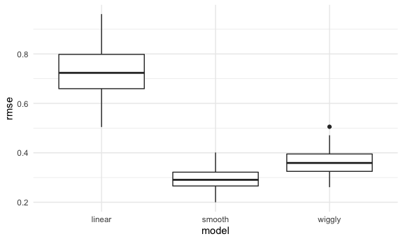

Cross Validation
================

Load libraries that you will need:

``` r
library(tidyverse)
```

    ## ── Attaching packages ─────────────────────────────────────── tidyverse 1.3.1 ──

    ## ✓ ggplot2 3.3.5     ✓ purrr   0.3.4
    ## ✓ tibble  3.1.3     ✓ dplyr   1.0.7
    ## ✓ tidyr   1.1.3     ✓ stringr 1.4.0
    ## ✓ readr   2.0.1     ✓ forcats 0.5.1

    ## ── Conflicts ────────────────────────────────────────── tidyverse_conflicts() ──
    ## x dplyr::filter() masks stats::filter()
    ## x dplyr::lag()    masks stats::lag()

``` r
library(viridis)
```

    ## Loading required package: viridisLite

``` r
library(modelr)
library(mgcv)
```

    ## Loading required package: nlme

    ## 
    ## Attaching package: 'nlme'

    ## The following object is masked from 'package:dplyr':
    ## 
    ##     collapse

    ## This is mgcv 1.8-36. For overview type 'help("mgcv-package")'.

``` r
set.seed(1)

knitr::opts_chunk$set(
  fig.width = 6,
  fig.asp = .6,
  out.width = "90%"
)

theme_set(theme_minimal() + theme(legend.position = "bottom"))

options(
  ggplot2.continuous.colour = "viridis",
  ggplot2.continuous.fill = "viridis"
)

scale_colour_discrete = scale_colour_viridis_d
scale_fill_discrete = scale_fill_viridis_d
```

## Tools for CV

-   add\_predictions() and add\_residuals
-   rmse()
-   crossv\_mc()

## Simulate a dataset

``` r
nonlin_df = 
  tibble(
    id = 1:100,
    x = runif(100, 0, 1),
    y = 1 - 10 * (x - .3) ^ 2 + rnorm(100, 0, .3)
  )

nonlin_df %>% 
  ggplot(aes(x = x, y = y)) + 
  geom_point()
```


Create splits by hand; plot; fit some models;

``` r
train_df = sample_n(nonlin_df, 80)
test_df = anti_join(nonlin_df, train_df, by = "id")

train_df %>% arrange(id)
```

    ## # A tibble: 80 × 3
    ##       id      x       y
    ##    <int>  <dbl>   <dbl>
    ##  1     1 0.266   1.11  
    ##  2     2 0.372   0.764 
    ##  3     3 0.573   0.358 
    ##  4     4 0.908  -3.04  
    ##  5     5 0.202   1.33  
    ##  6     6 0.898  -1.99  
    ##  7     7 0.945  -3.27  
    ##  8     9 0.629   0.0878
    ##  9    10 0.0618  0.392 
    ## 10    11 0.206   1.63  
    ## # … with 70 more rows

``` r
test_df
```

    ## # A tibble: 20 × 3
    ##       id      x      y
    ##    <int>  <dbl>  <dbl>
    ##  1     8 0.661  -0.615
    ##  2    18 0.992  -3.35 
    ##  3    21 0.935  -2.89 
    ##  4    22 0.212   0.710
    ##  5    30 0.340   0.807
    ##  6    36 0.668  -0.258
    ##  7    46 0.789  -1.23 
    ##  8    49 0.732  -1.24 
    ##  9    52 0.861  -2.14 
    ## 10    55 0.0707  0.278
    ## 11    59 0.662  -0.195
    ## 12    63 0.459   1.18 
    ## 13    69 0.0842  0.683
    ## 14    74 0.334   0.935
    ## 15    75 0.476   0.659
    ## 16    76 0.892  -2.29 
    ## 17    78 0.390   0.908
    ## 18    83 0.400   1.06 
    ## 19    89 0.245   0.775
    ## 20    91 0.240   0.389

``` r
ggplot(train_df, aes(x = x, y = y)) +
  geom_point() +
  geom_point(data = test_df, color = "red")
```


Fit my models:

``` r
linear_mod = lm(y ~ x, data = train_df)
smooth_mod = mgcv::gam(y ~ s(x), data = train_df)
wiggly_mod = mgcv::gam(y ~ s(x, k = 30), sp = 10e-6, data = train_df)
```

plot the results

``` r
train_df %>% 
  add_predictions(linear_mod) %>% 
  ggplot(aes(x = x, y = y)) +
  geom_point() +
  geom_line(aes(y = pred))
```


``` r
train_df %>% 
  add_predictions(smooth_mod) %>% 
  ggplot(aes(x = x, y = y)) +
  geom_point() +
  geom_line(aes(y = pred))
```


``` r
train_df %>% 
  add_predictions(wiggly_mod) %>% 
  ggplot(aes(x = x, y = y)) +
  geom_point() +
  geom_line(aes(y = pred))
```


Quantify the results

rmse = root mean squared error

``` r
rmse(linear_mod, test_df)
```

    ## [1] 0.7052956

``` r
rmse(smooth_mod, test_df)
```

    ## [1] 0.2221774

``` r
rmse(wiggly_mod, test_df)
```

    ## [1] 0.289051

## Cross Validation iteratively

Use ‘modelr::crossv\_mc’. - mc refers to Monte Carlo - partition the
nonlinear df 100 times - defaults to 20% in the testing data set

``` r
cv_df =
  crossv_mc(nonlin_df, 100)

cv_df %>% pull(train) %>% .[[1]] %>% as_tibble()
```

    ## # A tibble: 79 × 3
    ##       id      x       y
    ##    <int>  <dbl>   <dbl>
    ##  1     1 0.266   1.11  
    ##  2     2 0.372   0.764 
    ##  3     3 0.573   0.358 
    ##  4     4 0.908  -3.04  
    ##  5     6 0.898  -1.99  
    ##  6     7 0.945  -3.27  
    ##  7     8 0.661  -0.615 
    ##  8     9 0.629   0.0878
    ##  9    10 0.0618  0.392 
    ## 10    11 0.206   1.63  
    ## # … with 69 more rows

Now we want to convert everything to tibbles instead of ‘resamples’

``` r
cv_df =
  crossv_mc(nonlin_df, 100) %>% 
  mutate(
    train = map(train, as_tibble),
    test = map(test, as_tibble)
  )
```

Let’s fit some models…

``` r
cv_df %>% 
  mutate(
    linear_mod = map(.x = train, ~lm(y ~ x, data = .x))
  ) %>%
  mutate(
    rmse_linear = map2_dbl(.x = linear_mod, .y = test, ~rmse(model = .x, data = .y))
  )
```

    ## # A tibble: 100 × 5
    ##    train             test              .id   linear_mod rmse_linear
    ##    <list>            <list>            <chr> <list>           <dbl>
    ##  1 <tibble [79 × 3]> <tibble [21 × 3]> 001   <lm>             0.747
    ##  2 <tibble [79 × 3]> <tibble [21 × 3]> 002   <lm>             0.602
    ##  3 <tibble [79 × 3]> <tibble [21 × 3]> 003   <lm>             0.955
    ##  4 <tibble [79 × 3]> <tibble [21 × 3]> 004   <lm>             0.691
    ##  5 <tibble [79 × 3]> <tibble [21 × 3]> 005   <lm>             0.712
    ##  6 <tibble [79 × 3]> <tibble [21 × 3]> 006   <lm>             0.610
    ##  7 <tibble [79 × 3]> <tibble [21 × 3]> 007   <lm>             0.758
    ##  8 <tibble [79 × 3]> <tibble [21 × 3]> 008   <lm>             0.803
    ##  9 <tibble [79 × 3]> <tibble [21 × 3]> 009   <lm>             0.705
    ## 10 <tibble [79 × 3]> <tibble [21 × 3]> 010   <lm>             0.959
    ## # … with 90 more rows

Let’s fit some additional models

``` r
cv_df = cv_df %>% 
  mutate(
    linear_mod = map(.x = train, ~lm(y ~ x, data = .x)),
    smooth_mod = map(.x = train, ~gam(y ~ s(x), data = .x)),
    wiggly_mod = map(.x = train, ~gam(y ~ s(x, k = 30), sp = 10e-6, data = .x))
  ) %>%
  mutate(
    rmse_linear = map2_dbl(.x = linear_mod, .y = test, ~rmse(model = .x, data = .y)),
    rmse_smooth = map2_dbl(.x = smooth_mod, .y = test, ~rmse(model = .x, data = .y)),
    rmse_wiggly = map2_dbl(.x = wiggly_mod, .y = test, ~rmse(model = .x, data = .y))
  )
```

Look at the output Ideally using a boxplot

``` r
cv_df %>% 
  select(starts_with("rmse")) %>% 
  pivot_longer(
    rmse_linear:rmse_wiggly,
    names_to = "model",
    values_to = "rmse",
    names_prefix = "rmse_"
  ) %>% 
  ggplot(aes(x = model, y = rmse)) +
  geom_boxplot()
```



Boxplots help us understand across 100 testing and training datasets,
which one had the lowest rmse.
